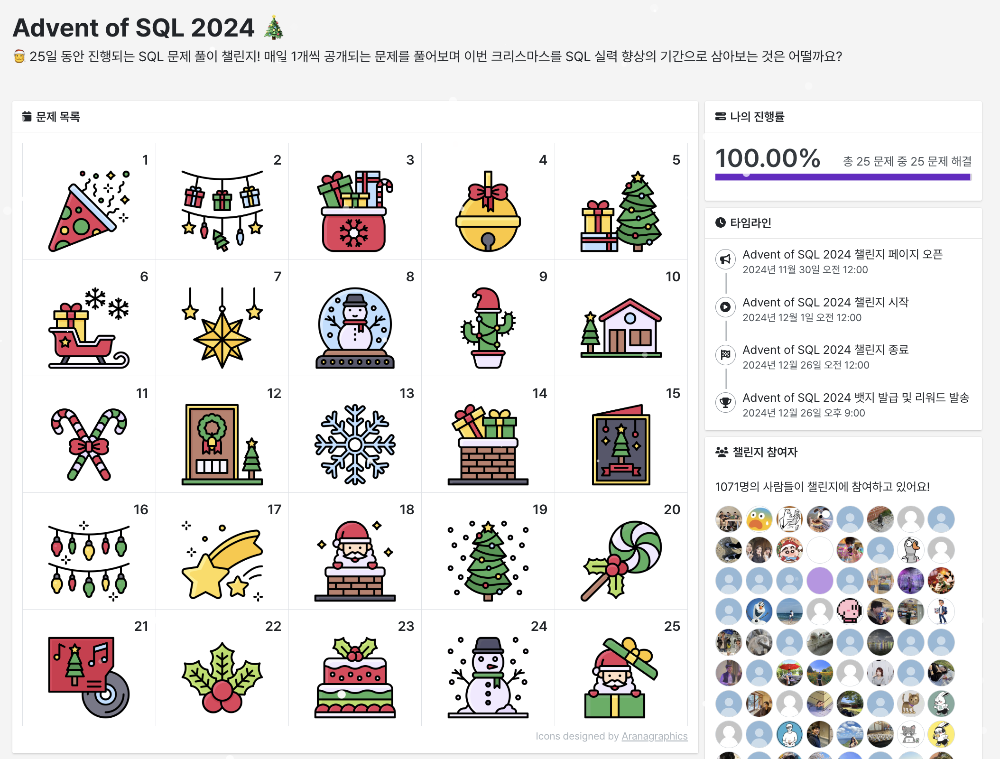

## Advent Of SQL 2024

https://solvesql.com/collections/advent-of-sql-2024/

---

[03. 제목이 모음으로 끝나지 않는 영화](./Solve/03.%20제목이%20모음으로%20끝나지%20않는%20영화.md)

[05. 언더스코어(\_)가 포함되지 않은 데이터 찾기](<./Solve/05.%20언더스코어(_)가%20포함되지%20않은%20데이터%20찾기.md>)

[07. 기증품 비율 계산하기](./Solve/07.%20기증품%20비율%20계산하기.md)

[08. 온라인 쇼핑몰의 월 별 매출액 집계](./Solve/08.%20온라인%20쇼핑몰의%20월%20별%20매출액%20집계.md)

[09. 게임 평점 예측하기 1](./Solve/09.%20게임%20평점%20예측하기%201.md)

[10. 최대값을 가진 행 찾기](./Solve/10.%20최대값을%20가진%20행%20찾기.md)

[11. 서울숲 요일별 대기오염도 계산하기](./Solve/11.%20서울숲%20요일별%20대기오염도%20계산하기.md)

[16. 스테디셀러 작가 찾기](./Solve/16.%20스테디셀러%20작가%20찾기.md)
